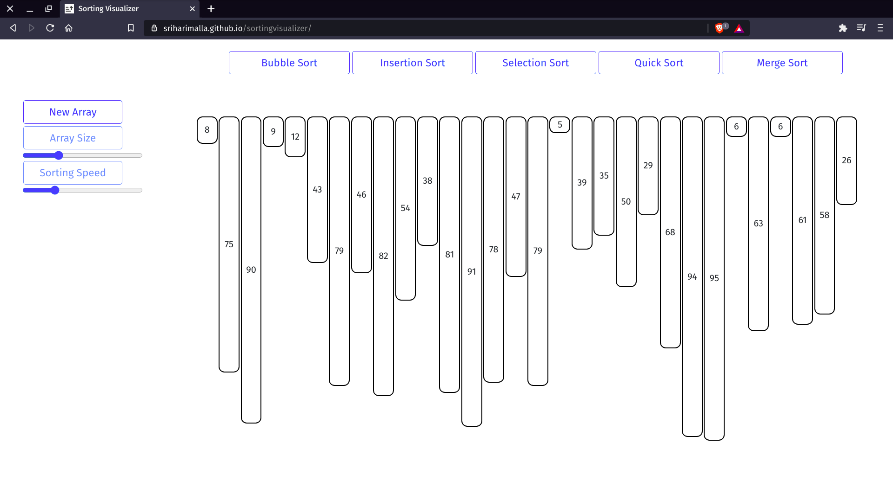
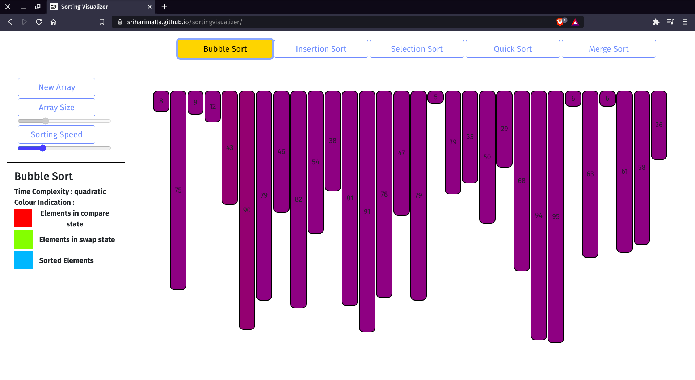
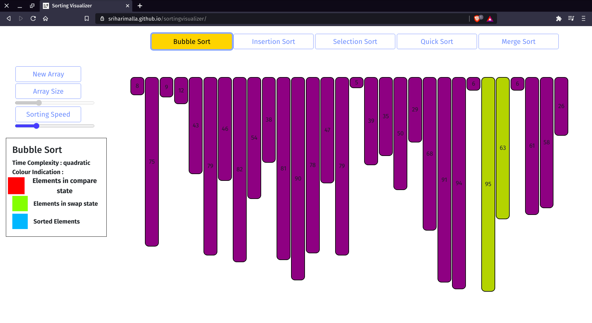

# Sorting Visualizer

website link: [https://srihari039.github.io/sortingvisualizer/]

## JavaScript beginner friendly project

## Directories

* **js**  
  All the source files are stored in this directory

* **styles**  
  All the styling sheets are stored in this directory

## File Navigation

```bash
Main-|
     | - README.md
     |
     | - index.html(main)
     |
     | - js - |
     |        | - utility - | 
     |                      | - index.js(main)
     |                      | - sortingOptions - |
     |                                           | - bubble-sort.js
     |                                           | - insertion-sort.js
     |                                           | - selection-sort.js
     |                                           | - quick-sort.js
     |                                           | - merge-sort.js
     |
     | - styles - |
                  | - style.css(main)
                  | - images

```

## Layout



* There will be the sorting options(buttons) on the top panel of the window.
  
* Buttons for the manipulation of array will be on the left side of the window.

## Side Panel



* Initially the new Array Button will be available to use.
  
* As soon as the user hits one of the sorting option, the new array button gets disabled and gets back into action as soon as the sorting is completed.
  
* The same is the case with the array size input.
  
* The input for sorting speed remains intact, i.e the user can interact with it at any point of time and the animation responds accordingly.

## While Running



* We can see the blob comming from the left of window to assist what's happening with algorithm.
  
* The colours changing in the bars can be clearly observed and with the blob on the left, one can easily get what's going on!.
  
